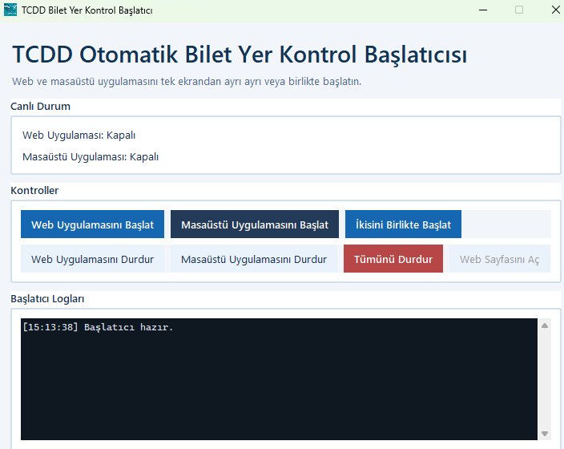
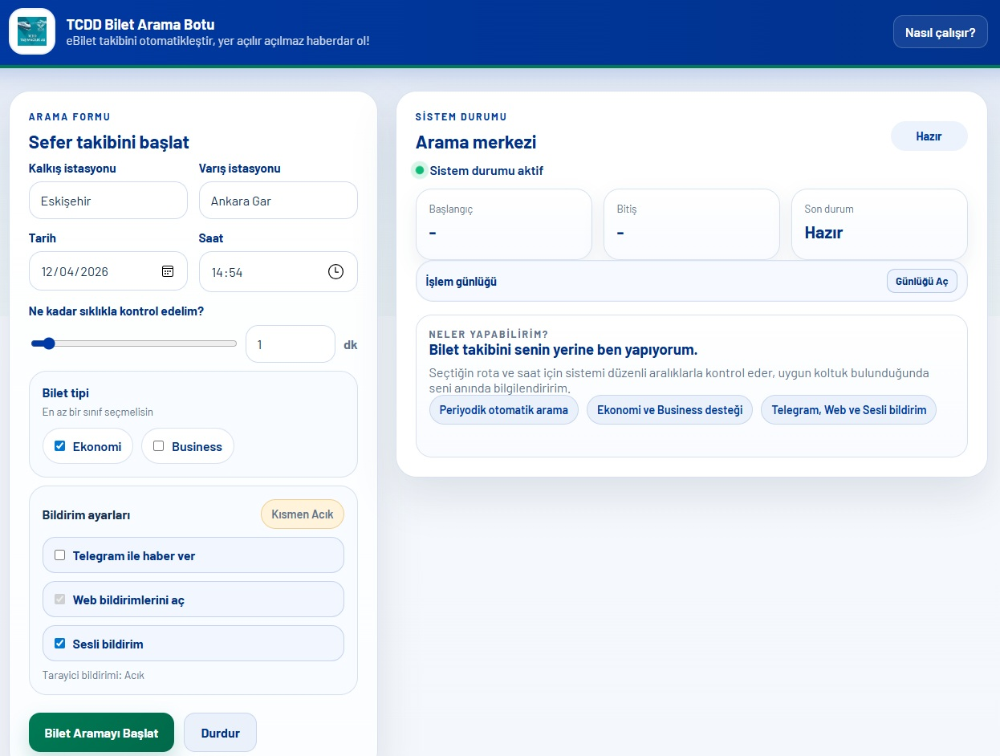
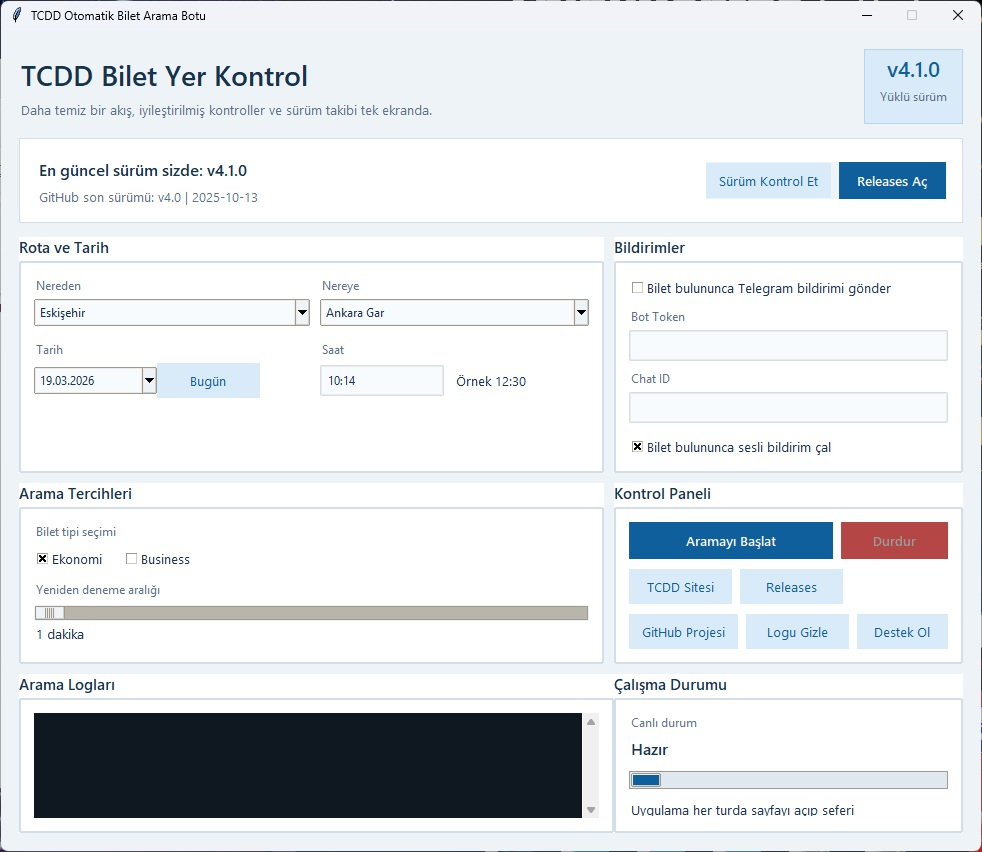

# TCDD Bilet Yer Kontrol

Bu proje TCDD eBilet tarafinda secilen rota/saat icin bos koltuk durumunu periyodik olarak kontrol eder. Bu uygulama, yolcuların bilet bilgilerini hızlı ve kolay bir şekilde aramalarina ve doğrulamalarına olanak tanır.

Yeni yapi:
- `backend`: Ortak algoritma katmani (web + desktop bunu kullanir)
- `webapp`: Flask arayuz dosyalari (template/static/routes)
- `desktop_app`: Tkinter masaustu uygulamasi
- `webapp/main.py`: Web uygulama giris noktasi
- `start_ui.py`: Web/Desktop launcher arayuzu

## Ozellikler

- Periyodik otomatik koltuk kontrolu
- Telegram bildirimi (opsiyonel)
- Web bildirim + sesli bildirim
- Web ve desktop tarafinda tek algoritma (`backend`)

## Kurulum

```powershell
pip install -r requirements_web.txt
pip install -r desktop_app\requirements.txt
```

Not:
- Selenium + Edge kullanildigi icin sistemde Microsoft Edge ve uygun `msedgedriver` olmalidir.
- Proje kokunde `msedgedriver.exe` varsa dogrudan kullanilir.

## Calistirma

Launcher UI (onerilen):
```powershell
python start_ui.py
```

Bu ekrandan:
- `Web Uygulamasini Baslat` ile Flask web server baslatilir (`http://127.0.0.1:5000`)
- `Masaustu Uygulamasini Baslat` ile Tkinter desktop uygulamasi baslatilir
- `Ikisini Birlikte Baslat` ile ikisi birlikte calistirilir
- `Durdur` butonlari ile ilgili process kapatilir

Web app:
```powershell
python -m webapp.main
```
Sonra: `http://127.0.0.1:5000`

Desktop app:
```powershell
python -m desktop_app.main
```

Launcher tarafinda process loglari proje kokunde olusur:
- `web_launcher.log`
- `desktop_launcher.log`

## Ekran Goruntuleri

Launcher UI:



Web App:



Desktop App:



## Domain Ile Yayina Alma

Evet, domain ile calisir. Ama web app'in arkasinda Selenium calistigi icin standart "statik site" gibi degil, bir sunucuda process olarak calismasi gerekir.

Gerekenler:
1. Linux/Windows (7/24 acik)
2. Python + Edge + `msedgedriver`
3. Flask uygulamasini proses yoneticisi ile calistirma (systemd, pm2, supervisor vb.)
4. Domain DNS -> sunucu IP
5. Nginx/Caddy reverse proxy + HTTPS (Let's Encrypt)

Onemli notlar:
- `webapp/main.py` su an gelistirme modunda (`debug=True`). Production'da `gunicorn`/`waitress` + reverse proxy kullanin.
- Uzun sureli Selenium isleri CPU/RAM tuketir; dusuk kaynakli hostinglerde yavaslayabilir.
- TCDD tarafindaki HTML degisirse `backend` icindeki selectorler guncellenmelidir.

## Gelistirici Notu

Tek algoritma kaynagi artik `backend` klasorudur. `desktop_app` veya `webapp` icine tekrar kopya algoritma dosyasi eklenmemelidir.

## Pip Paketi Hazirlama

Lint ve analiz:

```powershell
ruff check .
python -m compileall -q start_ui.py webapp desktop_app backend
```

Paket olusturma:

```powershell
python -m build
python -m twine check dist\tcdd_bilet_yer_kontrol-4.1.0.tar.gz
python -m twine check dist\tcdd_bilet_yer_kontrol-4.1.0-py3-none-any.whl
```

TestPyPI/PyPI yukleme:

```powershell
python -m twine upload --repository testpypi dist/*
python -m twine upload dist/*
```

Paket kurulduktan sonra gelen komutlar:
- `tcdd-launcher`
- `tcdd-web`
- `tcdd-desktop`

## Lisans

Proje GPL-3.0 ile lisanslidir. Detay: `LICENSE`.
